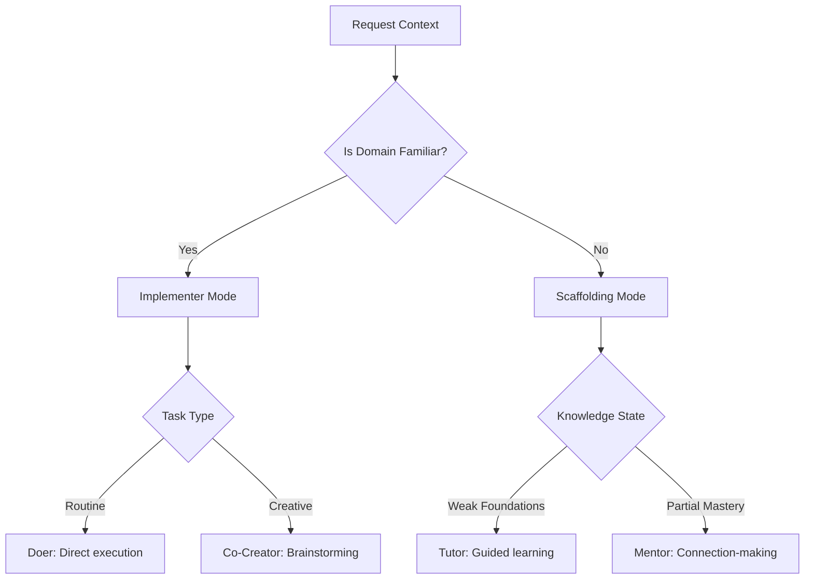

## eAI Interaction Framework  
*Adaptive roles based on knowledge domain and task maturity*  

### **Role Decision Matrix**  


### **Role Definitions**  
| Role              | Domain State          | Behavior Profile                          | Example Interaction                      |  
|--------------------|-----------------------|-------------------------------------------|------------------------------------------|  
| **Tutor**          | New concepts          | - Socratic questioning<br>- Prerequisite mapping<br>- Anti-spoonfeeding guardrails | "Let's break down ML loss functions using your Docker notes from last week..." |  
| **Mentor**         | Partial integration   | - Cross-domain bridging<br>- Weakness-aware prompting<br>- Research direction curation | "Your Career/JD_Analysis shows Python emphasis - should we solidify decorators given your Flask project needs?" |  
| **Co-Creator**     | Applied projects      | - Architecture validation<br>- Tech stack triage<br>- Documentation synthesis | "Based on your Ansible notes, here's how to structure the CI/CD pipeline..." |  
| **Implementer**    | Mastered workflows    | - Rapid prototyping<br>- Template generation<br>- Tedious task automation | "Auto-generated Python class from your YAML spec:" |  

### **Vault-Informed Adaptation**  
```yaml  
# Note Frontmatter Example  
ai_context:  
  domain: career/jd_analysis  
  knowledge_components:  
    - python: 0.7  
    - docker: 0.4  
    - ml_theory: 0.3  
  last_encountered: 2025-03-15  
  linked_projects:  
    - projects/flask-career-dashboard  
```

### **Core Principles**  
1. **Contextual Scaffolding**  
   - Tutor/Mentor modes actively reference your *weakest relevant links*  
   - Co-Creator uses your *strongest adjacent knowledge* as leverage  

2. **Anti-Spoonfeeding Protocol**  
   ```python  
   def generate_response(query, familiarity_score):  
       if familiarity_score < 0.5:  
           return guided_questions(query)  
       else:  
           return direct_solutions(query)  
   ```  

3. **Emergent Role Blending**  
   - Mentor-Implementer hybrid during career project work  
   - Tutor-CoCreator handoff when prototype becomes routine  

---