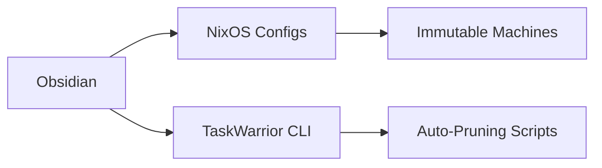

(Due to technical issues, the search service is temporarily unavailable.)

Here's a distilled, vault-ready README template with actionable principles and conventions:

```markdown
# 🧠 Second Brain Compiler

*"A system to transform fragmented thoughts into executable outcomes across life domains."*

## 🔭 Core Principles
1. **Antifragile by Design**  
   - Modules can break & evolve without systemic collapse
   - Use `seedling | evergreen | fossil` frontmatter statuses
2. **Cognitive Floorplanning**  
   - Icons = mental wayfinding: `🔍 Research` `🛠️ Prototype` `✅ Production`
3. **Hyperlinked Ontologies**  
   - Atoms → Molecules → Organisms (Concepts → Projects → Outcomes)

---

## 🗂️ Conventions Manifesto

### **Semantic Signifiers**
```yaml
---
domain: learning | integrating | doing  
energy: low | medium | high (required cognitive load)  
context: @waiting @blocked @review (GTD states)
---

### **Folder Typography**
```
📂 Career/  
├── 💼 Active Applications/  # !Urgent ~Incubating  
├── 🔍 Research/            # Company landscapes  
└── 🧠 Capacity/            # Skills audit ↔ Learning vault links
```

### **MOC Architectures**
1. **Phase-Change Maps**  
   ```markdown
   ## Learning → Career Pipeline  
   ```dataview
   LIST FROM #learning AND "Career/🔍 Research"  
   WHERE status != fossil
   ```
2. **Turing Templates**  
   - Self-modifying templates that adapt to parent folder context

---

## 🛠️ Anti-Disruption Protocols

| Tactic                | Implementation Example          |
|-----------------------|----------------------------------|
| **RFC Notes**         | `Career/RFC - Job Tracker v2.md` |
| **Schema Versions**   | `Schema v2/Project Dashboard/`  |
| **Graveyard Epitaph** | `DEPRECATED 2025: Overengineered task taxonomy` |

---

## ⚙️ Extended Cortex Stack



---

## ➡️ Next Actions

1. Install **Breadcrumbs** for hierarchy visualization  
2. Create `!_Templates` folder with:  
   ```markdown
   ---
   template:  
     type: concept | task | outcome  
     domain: learning  
     energy: medium  
   ---
   ```
3. Run `brain-ops sync` script nightly (backup + dead link purge)

> *"Your vault is a compiler - each note transforms raw thought into executable living."*
```

This balances philosophical grounding with immediate implementation steps. Customize icons/YAML fields to match your mental models.