# Brain Vault: A Living Knowledge Compiler  
**Mission:** *To create an antifragile second brain that evolves with my cognitive workflows while maintaining operational clarity across domains.*  

*"The mind is not a vessel to be filled, but a fire to be kindled."* - Plutarch (adapted for the digital age)

---

## Domain Architecture  
### Core Mental States  
| **Seedling** (💡) | **Cultivating** (🌱) | **Harvest** (🚀) |
|-------------------|-----------------------|-------------------|
| Raw ideas         | Active development    | Deployed systems  |
| `/Brainstorming`  | `/Integrating`        | `/Projects`       |
| Unstructured      | Prototypes            | Production-ready  |

### Knowledge Lifecycle  

```mermaid  
flowchart LR  
    A[💡 Learning] --> B[🌱 Integrating] --> C[🚀 Doing]  
    C -->|Feedback| A  
    style A fill:#FFEBEE,stroke:#FFCDD2  
    style B fill:#E8F5E9,stroke:#C8E6C9  
    style C fill:#E3F2FD,stroke:#BBDEFB  
```


---

## 🛠 Conventions & Semiotics  
### Visual Language System  
| Symbol       | Meaning                  | Example Use                          |
|--------------|--------------------------|--------------------------------------|
| `!`          | Urgent action            | `!Review Resume`                     |
| `~`          | Incubating idea          | `~AI Career Coach Concept`           |
| `#`          | Reference material       | `#Python Cheatsheet`                 |
| 🧪           | Experimental             | `🧪 Neural Note Linking`              |
| 🔄           | Recursive system         | `🔄 Knowledge Reinforcement Loop`    |

### File Taxonomy  
```bash  
Career/  
├── Active_Applications/         # Current focus  
├── Research/                    # Deep dives  
├── Capacity/                    # Energy mapping  
└── Archive/                     # Retired systems (with epitaphs)  
```

---

## Technical Foundations  
### Cognitive Automation Suite  
```python  
# Sample CLI Thought Integrator  
def capture_idea(idea, domain="General", urgency=3):  
    timestamp = datetime.now().isoformat()  
    with open(f"{DOMAINS[domain]}/{timestamp}.md", "w") as f:  
        f.write(f"# {idea}\nUrgency: {'⚠️'*urgency}")  
    sync_with_tasks(idea, domain)  # Connect to Todoist/ClickUp  
```

### Immutable Infrastructure  
```nix  
# NixOS configuration snippet  
{ pkgs, ... }: {  
  environment.systemPackages = with pkgs; [  
    obsidian  
    (python3.withPackages (ps: [ps.numpy ps.transformers]))  
  ];  
  system.autoUpgrade.enable = true;  # Keep knowledge tools fresh  
}  
```

---

## Career Domain Implementation  
### Before vs After  
**Original Structure**  
```  
Career/.../Khamu Solutions/Job Descriptions/Support Specialist.md  
```  

**Reengineered Flow**  
```  
Active_Applications/  
└── !Khamu_2025Q3/  
    ├── JD_Analysis.md              # With embedded salary benchmarks  
    ├── Cover_Letters/              # Template-driven  
    │   ├── v1_Technical.md         # Git-tracked revisions  
    │   └── v2_Strategic.md  
    └── Interview_Prep/  
        ├── Behavioral/             # Linked to Leadership MOC  
        └── Technical/              # Linked to Learning/Docker  
```

---

## Anti-Disruption Protocols  
1. **Schema Versioning**  
   ```bash  
   git tag vault-v1.3.2 -m "Career module refactor"  
   ```  
2. **RFC (Request For Comments) System**  
   ```markdown  
   ---  
   rfc_id: 2025-03_AI-Integration  
   proposed_by: @Aaron  
   status: reviewing  
   ---  
   Should we implement neural search across all MOCs?  
   ```  
3. **Graveyard Epitaphs**  
   ```  
   ⚰️ Deprecated 2024: Manual CV Builder  
   Cause of Death: Overcome by Obsidian-Templater automation  
   Lessons Learned: Auto-generate from YAML master profile  
   ```

---

## Future Evolution  
**Augmented Cognition Pipeline**  
1. **Biometric Integration**  
   ```python  
   if heart_rate > 120:  
       log_idea("Adrenaline Insight", context="Eureka Moment")  
   ```  
2. **AI Co-Processor**  
![[AI_INTERACTION.md#**Role Definitions**]]
1. **Quantum Readiness**  
   ```markdown  
   ---  
   q_encrypted: true  
   q_timestamp: 2035-02  
   ---  
   Future-proofed career strategy for post-quantum job market...  
   ```

---

**This vault isn't software - it's mindware.**  
Version: `BrainOS 0.9.4-alpha` | Last Compiled: {{date}}  
Maintained under **Nonlinear Development License** - evolve freely but preserve core axioms.  

--- 

This README serves as both documentation and philosophical manifesto. The actual vault includes interactive elements powered by DataviewJS and executable code blocks.


